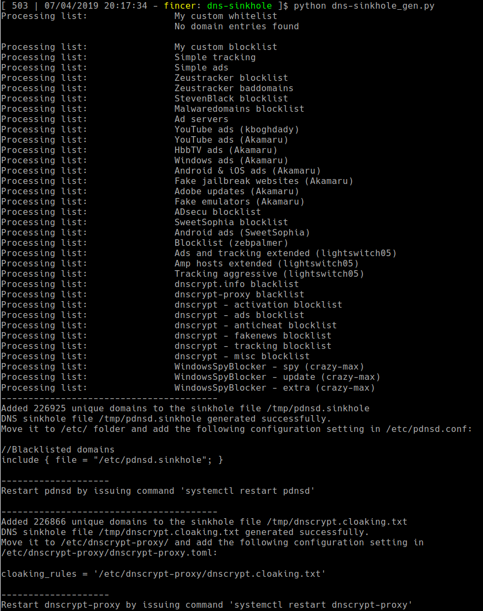
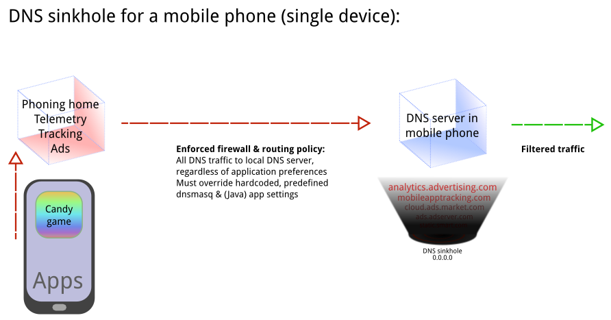
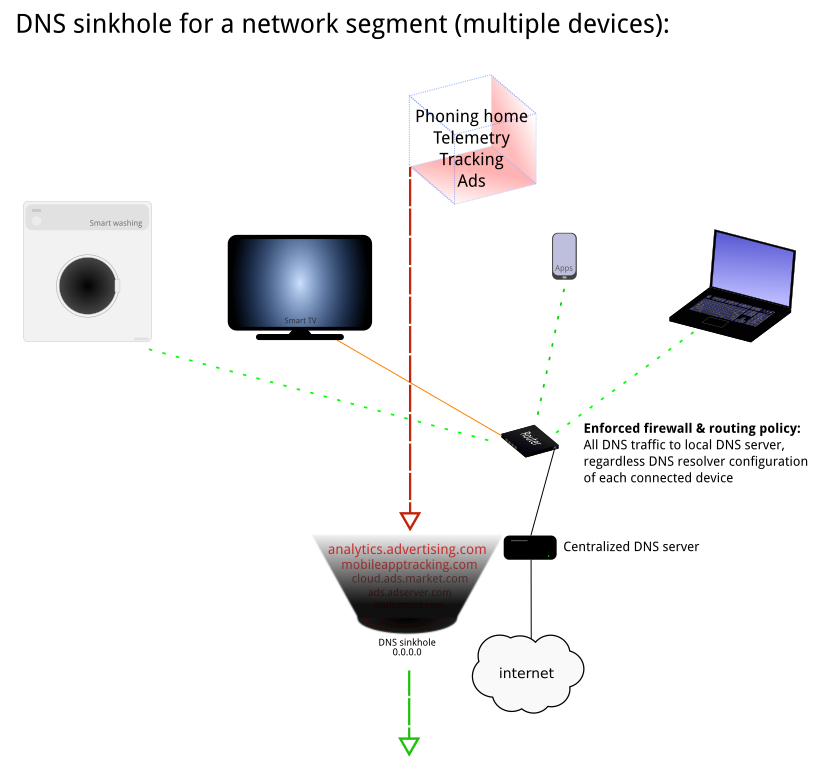

# [DNS sinkhole](https://en.wikipedia.org/wiki/DNS_sinkhole)

Generate domain sinkhole (blacklist) files for [DNSCrypt](https://github.com/jedisct1/dnscrypt-proxy) and [pdnsd](http://members.home.nl/p.a.rombouts/pdnsd/) DNS servers. Comparable to Pi-Hole, but uses more simple structure without too much overhead. Generated blacklist files can be added to existing DNS server installations.



----------

# Usage

Add blacklists and whitelists as you wish into [the python script](data/dns-sinkhole_gen.py). Once done, run the script with Python 3. The script generates necessary files for you to adapt to your DNS servers.

----------

# Developer's notice

## Benefits:

Useful for blocking ads, tracking & telemetry on:

- single device with a DNS server

- on a full network segment if a centralized DNS server is used (multiple devices)

- applies to IoT devices (+ SmartTVs etc.) if traffic is routed via a centralized DNS server applying this sinkhole/blacklist policy

**NOTE (Tor users):** These lists do not work with SOCKS5/HTTP Tor connections, as DNS resolution is done on the Tor exit nodes, not by your DNS server(s).

### Tested on

```
Arch Linux (x86_64):           DNSCrypt server, pdnsd server
Android (mobile phone, ARMv7): DNSCrypt server
```

## About used list formats

### pdnsd

Although pdnsd offers `neg` feature, it is not very reliable with large DNS blocklists. However, custom `rr` (Resource Record) entries have been tested with a list of over 240 000 blacklisted domains, and it works as expected.

### DNSCrypt

Although DNSCrypt offers blacklist feature, it is not very reliable with large DNS blocklists. However, cloaking list has been tested with a list of over 240 000 blacklisted domains, and it works as expected.

----------

## Basic principle/idea

### Single device



### Multiple devices



----------

### Detecting malicious network traffic on Android & (embedded) IoT devices

Network analysis is strongly encouraged for mobile phones and (embedded) IoT devices to detect malicious or unwanted connections which are usually taking place without user's knowledge. You can use results of the analysis to build your own DNS sinkhole blacklist for devices or network segments.

You can use `tcpdump` or `wireshark` for network analysis purposes.

Mobile phones: you may consider limiting count of installed applications. More applications you have, more unwanted network traffic may occur.

Be aware that some applications or websites may break if too greedy policy is taken in place. DNS sinkhole works at best with combination of other network filtering/firewall policy applied, as well (application & network/data link layers). Understanding [OSI model](https://en.wikipedia.org/wiki/OSI_model) and/or [TCP/IP protocol stack](https://en.wikipedia.org/wiki/Internet_protocol_suite) helps you to build a proper policy for your network devices.

----------

# License

This repository uses MIT license. See [LICENSE](LICENSE) file for details.
